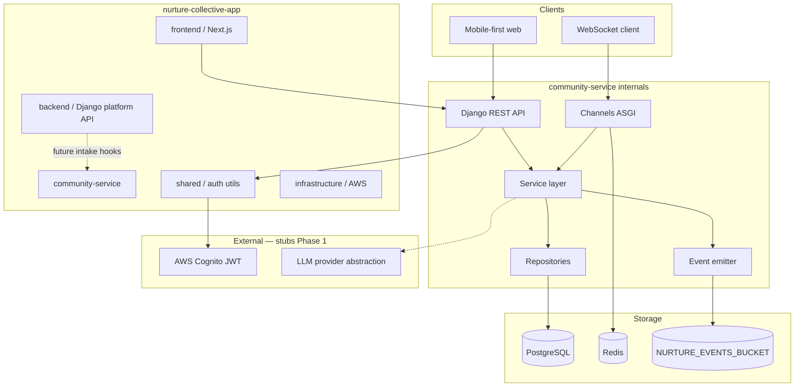
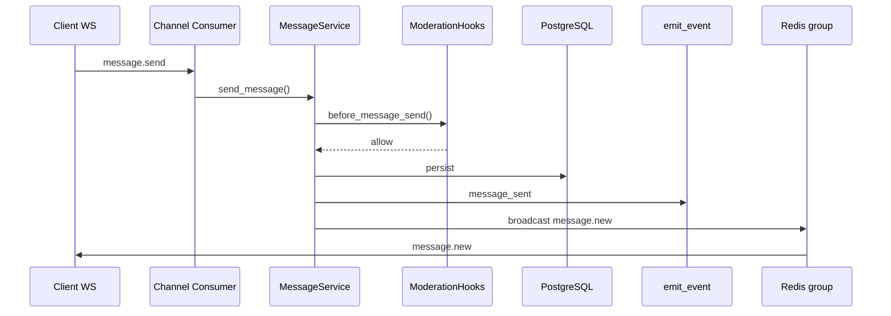

# Community Service — Architecture

**Status:** Approved for implementation  
**Monorepo path:** `nurture-collective-app/community-service/`

---

## Purpose

Retention and engagement platform for maternity/postpartum users: communities, group/DM messaging, cohort matching, AI companion, and event-driven analytics.

Integrates later with existing onboarding, SMS concierge, and billing — not in Phase 1.

---

## Approved decisions

| # | Decision | Choice |
|---|----------|--------|
| 1 | Operational DB | **PostgreSQL** (no SQLite in prod) |
| 2 | Repository layout | **Monorepo** — `backend/`, `frontend/`, `community-service/`, `shared/`, `infrastructure/` |
| 3 | Cohort engine | **Hard-coded services** — `assign_pregnancy_cohort()`, `assign_postpartum_cohort()`, `assign_newborn_cohort()` |
| 4 | Realtime | **Django Channels + Redis + ASGI** |
| 5 | Event storage | Reuse **`NURTURE_EVENTS_BUCKET`** under `community/`, `messaging/`, `cohorts/`, `analytics/` |
| 6 | Build order | Communities → Messaging → Cohorts → Analytics → AI |
| 7 | Events | Every major action emits via `emit_event()` |
| 8 | Feature flags | `ENABLE_COMMUNITIES`, `ENABLE_GROUP_CHAT`, `ENABLE_COHORTS`, `ENABLE_AI` |
| 9 | Multi-tenant prep | `organization_id` on major tables |
| 10 | Moderation | Hook interfaces only — no logic yet |

---

## System context



---

## Layering rules

```
api/views/          → HTTP/WS adapters only (validation, auth, response)
services/           → Business logic, orchestration, feature flags
repositories/       → DB access, query composition
models/             → Django ORM schema
analytics/emitter   → emit_event() — async-friendly, retry-ready
```

**Prohibited:** business logic in views, serializers, or consumers beyond delegation.

---

## Authentication & RBAC

- **Reuse** existing Cognito User Pool (`shared/auth` — TODO Sprint 0/1)
- JWT middleware validates `Authorization: Bearer <token>`
- Platform roles: `parent`, `provider`, `admin`
- Community-scoped roles: `member`, `moderator`, `owner` (separate from platform role)

| Action | parent | provider | admin |
|--------|--------|----------|-------|
| Join public community | ✓ | ✓ | ✓ |
| Create community | — | flag | ✓ |
| Moderate community | — | owner/mod | ✓ |
| Assign cohorts (manual) | — | — | ✓ |

---

## Realtime architecture

Messaging transport is **abstracted behind services** — WebSocket consumers call `MessageService.send()` / `ChannelService`, never write to DB directly.



**Presence hooks:** stub interface in `messaging/presence/` — `user_joined()`, `user_left()` (Phase 1 no-op).

**Read receipts:** `ChannelMember.last_read_at` + `message_read` event.

---

## Cohort engine (Phase 1)

Hard-coded assignment services — **no JSON rule engine**.

```python
# services/cohorts/assignment.py (interface only — implement Sprint 3)
def assign_pregnancy_cohort(user_id, profile) -> list[CohortAssignment]: ...
def assign_postpartum_cohort(user_id, profile) -> list[CohortAssignment]: ...
def assign_newborn_cohort(user_id, profile) -> list[CohortAssignment]: ...
def assign_all_cohorts(user_id, profile) -> list[CohortAssignment]: ...  # re-runnable
```

Multiple memberships allowed. Re-running assignment is idempotent (skip existing, add new matches).

---

## Event-driven analytics

All major actions call `emit_event()`:

| Event | Domain prefix |
|-------|---------------|
| `community_created` | `community/` |
| `community_joined` | `community/` |
| `community_left` | `community/` |
| `message_sent` | `messaging/` |
| `message_read` | `messaging/` |
| `cohort_assigned` | `cohorts/` |
| `post_created` / `post_updated` / `post_deleted` | `messaging/` |
| `comment_created` | `messaging/` |
| `reaction_added` / `reaction_removed` | `messaging/` |
| `ai_question_asked` | `analytics/` |

S3 path pattern:

```
s3://{NURTURE_EVENTS_BUCKET}/{domain}/event_type={type}/year={Y}/month={M}/day={D}/hour={H}/{event_id}.json
```

Example:

```
community/event_type=community_joined/year=2026/month=05/day=31/hour=14/550e8400-e29b-41d4-a716-446655440000.json
```

`emit_event()` requirements: async-friendly (Celery task wrapper), retry with backoff, batch API stub for later.

---

## AI companion (Phase 1 — abstraction only)

Provider pattern:

```
ai_companion/providers/base.py      → AIProvider protocol
ai_companion/providers/stub.py      → tests
ai_companion/providers/openai.py     → production (flag-gated)
ai_companion/safety/middleware.py   → pre/post filters
ai_companion/prompts/               → versioned prompt templates
```

Functions (service layer):

- `daily_checkin()`
- `answer_question()`
- `recommend_resources()`
- `escalate_to_human()`

---

## Moderation hooks (stubs)

```python
# messaging/moderation/hooks.py
def before_message_send(sender_id, channel_id, body, metadata) -> ModerationDecision: ...
def content_review(message_id) -> ModerationDecision: ...
def escalate_flagged_content(message_id, reason) -> None: ...
```

Phase 1: all return `ALLOW`. No moderation logic.

---

## Feature flags

Environment-configurable, injectable via `infrastructure/feature_flags.py`:

| Flag | Default (local) | Gates |
|------|-----------------|-------|
| `ENABLE_COMMUNITIES` | `true` | Community CRUD + join/leave |
| `ENABLE_GROUP_CHAT` | `true` | Group channels + WS |
| `ENABLE_COHORTS` | `false` | Cohort endpoints + assignment |
| `ENABLE_AI` | `false` | AI companion endpoints |

---

## Out of scope (Phase 1)

- Notifications delivery
- Payment integration
- WhatsApp / Twilio
- Production CI/CD pipelines
- Moderation UI and logic
- JSON cohort rule engine

---

## Future split boundary

Each Django app (`communities`, `messaging`, `cohorts`, `ai_companion`) owns its models, services, and repositories. Cross-app calls go through service interfaces only — enables extracting `community-service` to a separate repo later.
