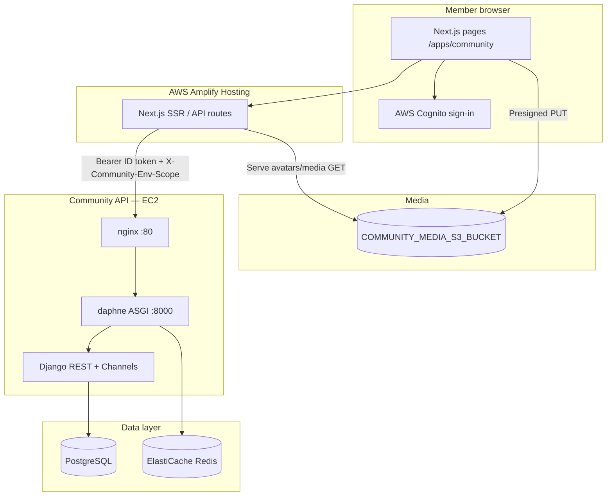

# Communities App — Architecture

Member-facing **Community** app in The Nesting Place: browse and join groups, post to a feed (text + photos), comment, react, and (when enabled) realtime channel chat.

**Brand copy on the app:** *Every mom deserves a team* — *Building communities where moms lift each other up*

---

## System overview



| Layer | Technology | Role |
|-------|------------|------|
| UI | Next.js 13 App Router (`src/app/(site)/apps/community/`) | List, detail, post thread, composer |
| BFF | Next.js API routes (`src/app/api/community/*`, `src/app/api/account/avatar/*`) | Auth, proxy to Django, presigned S3 uploads |
| API | `community-service` (Django 5 + DRF + Daphne) | Communities, memberships, posts, comments, reactions |
| Auth | Cognito user pool (same as main app) | ID token validated in Django via JWKS |
| DB | PostgreSQL | Communities, posts, comments, channels |
| Cache / WS | Redis | Channel layers (group chat WebSocket) |
| Media | S3 (private) | Post images + profile avatars; served via Next.js proxy routes |

---

## Monorepo layout

```
nurture-collective-app/
├── src/
│   ├── app/(site)/apps/community/     # Pages: list, community detail, post detail
│   ├── app/api/community/             # Proxies to community-service
│   ├── app/api/account/avatar/        # Profile photo upload + serve
│   ├── components/Community/          # Feed, composer, reactions, chat UI
│   ├── components/Member/CommunityView.tsx
│   └── lib/
│       ├── api/communityApi.ts        # Communities list / join / create
│       ├── api/communityDiscussionApi.ts  # Posts, comments, reactions, image upload
│       ├── community/client.ts        # Live API + demo fallback
│       ├── community/config.ts        # COMMUNITY_API_URL, env scope, demo flag
│       ├── community/proxy.ts         # Server-side forward to Django
│       └── community/postImageStorage.ts / account/profileAvatar*
└── community-service/
    ├── api/v1/views/                  # communities, discussions, users, messaging
    ├── communities/                   # Community + membership domain
    ├── messaging/                     # Posts, comments, reactions, channels, messages
    ├── users/                         # Profiles + Cognito auth
    └── community_platform/            # Settings, env scope middleware
```

---

## Request flow (authenticated)

1. Member signs in via Amplify (Cognito **ID token** in the browser).
2. Client calls same-origin routes, e.g. `GET /api/community/communities/{id}/posts`.
3. Next.js `requireMemberAuth` verifies the token, then `proxyCommunityRequest` forwards to `COMMUNITY_API_URL` with:
   - `Authorization: Bearer <id_token>`
   - `X-Community-Env-Scope: dev | production` (from `COMMUNITY_ENV_SCOPE` / `NEXT_PUBLIC_COMMUNITY_ENV_SCOPE`)
4. Django `AuthMiddleware` validates JWT → `UserProfile` + `AuthContext`.
5. `DiscussionService` checks community **membership**, filters posts by **env_scope**, returns JSON.
6. Client renders feed; optional retries on transient SSR errors (`communityFetch.ts`).

---

## Deployment scope (dev vs production)

Dev and production Amplify branches currently share **one** community-service host (`COMMUNITY_API_URL`). Post feeds are isolated in the database:

| Field | Where set | Purpose |
|-------|-----------|---------|
| `COMMUNITY_ENV_SCOPE` | Amplify env (per branch) | `dev` on dev branch, `production` on main |
| `CommunityPost.env_scope` | Set on create from request header | List/detail only return matching scope |
| S3 key prefix | `community-post-images/{scope}/...` | Media separated by environment |

**Dev branch** (`COMMUNITY_ENV_SCOPE=dev`): posts and photos are invisible to production users.

**Production** (default `production`): live member feed.

Local development defaults to `dev` when `NODE_ENV=development` (see root `.env.example`).

---

## Media uploads (why presigned S3)

Amplify’s CDN/SSR layer rejects large **multipart** bodies to Next.js route handlers. Upload flow:

1. Client compresses image (avatars) or validates size (post photos).
2. `POST /api/.../presign` with JSON `{ contentType }` → small response with presigned **PUT** URL.
3. Browser uploads bytes **directly to S3** (CORS must include your app origin — run `infrastructure/aws/scripts/configure-community-media-cors.sh`).
4. Avatars: `PATCH /api/community/users/me` with `avatar_url`.
5. Posts: create post with `image_urls` pointing at `/api/community/media/...` (Next.js reads from S3 and streams GET).

Legacy multipart routes remain for **local dev** when `COMMUNITY_MEDIA_S3_BUCKET` is unset (filesystem under `.data/`).

---

## Backend API surface (v1)

| Area | Endpoints | Notes |
|------|-----------|--------|
| Communities | `GET/POST /api/v1/communities/`, `GET /api/v1/communities/{id}/`, join/leave | Any member can create a community (creator = owner) |
| Profile | `GET/PATCH /api/v1/users/me/` | Display name, avatar URL in `profile_metadata` |
| Feed | `GET/POST /api/v1/communities/{id}/posts/` | Requires membership; scoped by env |
| Post | `GET/PATCH/DELETE /api/v1/communities/{id}/posts/{post_id}/` | Authors may edit or delete their own posts |
| Comments | `GET/POST .../posts/{post_id}/comments/` | One level of replies |
| Reactions | `POST/DELETE .../posts/{post_id}/reactions/` | like, love, care, etc. |
| Health | `GET /health/` | Load balancer probe |

Feature flag: `ENABLE_GROUP_CHAT` gates discussion routes.

---

## Data model (feed)

```
Organization
  └── Community (visibility: public | private)
        ├── CommunityMembership (role: owner | member | …)
        ├── Channel ("General" default)
        │     ├── ChannelMember
        │     └── Message (legacy realtime chat — separate from feed)
        └── CommunityPost (env_scope, image_urls[], moderation_status)
              ├── PostComment (optional parent → one reply level)
              └── PostReaction (one per user per post)
```

Communities and memberships are **not** scoped by env; only **posts** (and thus comments/reactions) are.

---

## Production infrastructure (current)

| Resource | Purpose |
|----------|---------|
| Amplify app `nurture-collective-app` | Next.js frontend; branch `dev` vs `main` |
| EC2 + Elastic IP | `community-service` (nginx → daphne) |
| RDS Postgres | Primary database |
| ElastiCache Redis | Channels / Celery |
| S3 `nurture-community-media-dev-886436941204` | Post images + avatars (private) |
| Cognito pool `us-east-1_rUfTimytf` | Production member auth (must match Amplify `NEXT_PUBLIC_USER_POOL_*`) |

Deploy backend changes:

```bash
source /tmp/nurture_aws.env   # KEYFILE, EIP
chmod +x community-service/scripts/deploy-ec2.sh
./community-service/scripts/deploy-ec2.sh
```

Or manually: rsync `community-service/` to EC2, set `ENABLE_COHORTS=true` in `/opt/nurture/community-service/.env`, `migrate`, `seed_cohorts_demo`, `systemctl restart nurture-daphne`.

---

## Environment variables

### Next.js (Amplify / `.env.local`)

| Variable | Description |
|----------|-------------|
| `COMMUNITY_API_URL` | Django base URL (server-side proxy) |
| `COMMUNITY_ENV_SCOPE` | `dev` \| `staging` \| `production` |
| `NEXT_PUBLIC_COMMUNITY_ENV_SCOPE` | Same value baked for client UI hints |
| `COMMUNITY_MEDIA_S3_BUCKET` | S3 bucket for uploads |
| `COMMUNITY_DEMO_FALLBACK` | `true` = use local demo data when API errors |
| `SERVER_AWS_ACCESS_KEY_ID` / `SECRET` | S3 presign + media read on SSR |

### Django (`community-service/.env`)

| Variable | Description |
|----------|-------------|
| `DATABASE_URL` | PostgreSQL |
| `REDIS_URL` / `CELERY_BROKER_URL` | Redis |
| `COGNITO_USER_POOL_ID` / `CLIENT_ID` | JWT validation |
| `JWT_DEV_BYPASS` | `true` only for local dev |
| `COMMUNITY_ENV_SCOPE` | Fallback if proxy header missing |
| `CORS_ALLOWED_ORIGINS` | Amplify app URLs |
| `ENABLE_COHORTS` | `true` on EC2 when cohort matching is live |

---

## Operations

### Seed starter communities

```bash
python manage.py seed_communities_demo
python manage.py seed_community_channels
python manage.py seed_cohorts_demo   # after communities exist; needs ENABLE_COHORTS=true
```

### Reset feed + chat messages (keeps communities & members)

```bash
python manage.py purge_community_feed --yes
```

Use `--dry-run` to preview counts. Does **not** delete S3 objects (orphaned images may remain; safe to ignore or lifecycle later).

### Local dev

See [local-dev.md](local-dev.md) and root `COMMUNITY_API_URL=http://localhost:8001`.

---

## Related docs

- [communities-implementation-plan.md](communities-implementation-plan.md) — **Next phases** (cohorts → analytics → AI)
- [architecture.md](architecture.md) — Whole community-service platform plan
- [database-schema.md](database-schema.md) — Table reference
- [../README.md](../README.md) — Quick start
