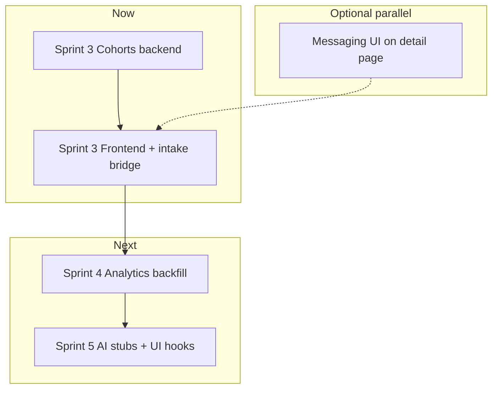

# Communities App — Next Implementation Plan

This document is the **actionable plan** for work after the approved build order items **Communities** and **Messaging** (see [README](../README.md)). It aligns with [migration-plan.md](migration-plan.md), [api-contracts.md](api-contracts.md), and [communities-app.md](communities-app.md).

**Last updated:** 2026-06-02

---

## Executive summary

| Build order step | Status | Next action |
|----------------|--------|-------------|
| 1. Communities | Shipped | Maintain; optional polish (comment edit, post image edit) |
| 2. Messaging | Backend + `CommunityChat` component exist | **Gap:** chat not mounted on community detail; prod `wss` + env |
| **3. Cohorts** | **Stub only** (`cohorts/models.py`, assignment TODOs) | **Start here** — Sprint 3 |
| 4. Analytics events | Partial (`community_*`, `message_*`; not feed actions) | Sprint 4 after cohorts |
| 5. AI layer | Stub | Sprint 5 |

**Recommended primary track:** implement **Sprint 3 — Cohorts** end-to-end (API → assignment → member UI → intake hook), then **Sprint 4 — Analytics** backfill, then **Sprint 5 — AI** for member-facing companion surfaces.

**Optional parallel slice (not a separate build-order step):** wire **General discussion** chat into `CommunityDetailView` so Messaging ✓ matches member UX (see [§2 Messaging completion](#2-messaging-completion-optional-parallel)).

---

## 1. Current state (what is already shipped)

### Backend (`community-service`)

- Communities CRUD, join/leave, memberships; discussion feed (posts, comments, reactions).
- Post `env_scope` + `COMMUNITY_ENV_SCOPE` / `X-Community-Env-Scope` isolation.
- Author-only post PATCH/DELETE.
- Users `GET/PATCH /api/v1/users/me/` with `profile_metadata` (avatar, display name).
- Messaging: channels per community (`seed_community_channels`), REST messages, WebSocket consumer, `message_sent` / `message_read` events.
- Analytics: `emit_event()` for community create/join/leave and messages; local/S3 writers exist.
- Cohorts app: **no models migration, no views, no assignment implementation**.
- Feature flags: `ENABLE_COHORTS=false`, `ENABLE_AI=false` (`.env.example`).

### Frontend (`src/`)

- `/apps/community` — list, detail, post thread; feed composer, reactions, create community, post owner edit/delete.
- Brand slogans on `CommunityView`.
- BFF proxies under `/api/community/*`; presigned S3 for avatars and post images.
- `CommunityChat.tsx` + `communityMessagingApi.ts` — **not used** in `CommunityDetailView` (feed only).
- **No cohort UI or API client** yet.
- Intake lives in monorepo S3/local storage; **no sync** of `dueDate` / stage into Django `profile_metadata` today.

### Production (dev branch)

- EC2 + RDS + Redis + Cognito + Amplify `dev` with `COMMUNITY_ENV_SCOPE=dev`.
- Ops: `purge_community_feed`, `seed_communities_demo`, daphne for WS.

---

## 2. Messaging completion (optional parallel)

README marks Messaging ✓ because REST + WS + events exist. For the **member Communities app**, treat this as a **small UX slice** you can run in parallel with cohort backend work:

| Task | Owner | Acceptance |
|------|--------|------------|
| M.1 | Frontend | Add **Feed | Chat** tabs (or sections) on `CommunityDetailView`; render `CommunityChat` when member + not demo |
| M.2 | Frontend | Ensure `getCommunityWsBaseUrl()` resolves on Amplify (e.g. `NEXT_PUBLIC_COMMUNITY_WS_URL` or derive `wss` from API host) |
| M.3 | Infra | nginx: `proxy_http_version 1.1`, `Upgrade`, `Connection` for `/ws/` → daphne |
| M.4 | QA | Member sends message → appears via WS; refresh shows history via REST |

**Do not block Sprint 3 on M.1–M.4** unless product requires chat before cohort recommendations.

---

## 3. Sprint 3 — Cohorts (primary next phase)

**Goal:** Hard-coded assignment + recommendations + manual join, with auto-join of `linked_community_id` and intake-triggered assignment (README integration TODO).

### 3.1 Data model and migrations

Implement per [database-schema.md](database-schema.md):

- `cohorts_cohort` — `cohort_type` (`pregnancy` | `newborn` | `postpartum`), name, description, `linked_community_id`, `window_start` / `window_end`, `is_active`.
- `cohorts_membership` — unique `(user_id, cohort_id)`, `source` (`auto` | `manual` | `recommended`), `assigned_at`, optional `expires_at`.

Files to add/change:

- `cohorts/models.py` — real models (replace stub comment).
- `cohorts/migrations/0001_initial.py`
- `cohorts/repositories.py` — list/filter cohorts, upsert membership idempotently.

**Seed data:** extend `seed_communities_demo` or add `seed_cohorts_demo` — **6 cohorts** (2 per type) with date windows aligned to existing starter communities ([database-schema.md](database-schema.md) seed table).

### 3.2 Assignment rules (Phase 1 — hard-coded)

No JSON rule engine. Implement in `cohorts/services/assignment.py` + `cohorts/services/recommendations.py`:

| Function | Input (`profile_metadata`) | Match logic (document in code) |
|----------|---------------------------|--------------------------------|
| `assign_pregnancy_cohort` | `due_date` (ISO date) | Active pregnancy cohort where `window_start <= due_date <= window_end` (inclusive). If multiple match, pick narrowest window or first by `created_at`. |
| `assign_postpartum_cohort` | `postpartum_weeks` (int) | Active postpartum cohort whose window represents week range (e.g. 0–12, 13–26). Derive weeks from intake when missing (see §3.5). |
| `assign_newborn_cohort` | `newborn_age_days` (int) | Active newborn cohort by age-day window. |
| `assign_all_cohorts` | full metadata | Call all three; **idempotent** — skip existing `(user_id, cohort_id)`; return only **new** assignments. |

**Recommendations:** `RecommendationService.recommend(user_id)` — same rules, return scored list (`score`, `reason`) for cohorts user is **not** yet in; do not auto-assign on GET.

**Edge cases (tests required):**

- Missing `due_date` / weeks / days → no assignment for that type; no 500.
- Invalid dates → treat as absent.
- `force_refresh` on `POST /cohorts/assign/` — re-evaluate rules; still idempotent on membership rows.

### 3.3 Side effects on assign

On each new `cohorts_membership` (auto or manual):

1. `emit_event("cohort_assigned", …)` with `cohort_id`, `cohort_type`, `source`, `linked_community_id`.
2. If `linked_community_id` set → call existing `MembershipService.join` (or equivalent) so user enters linked community without a second click (respect visibility / already-member).

### 3.4 API layer

Per [api-contracts.md](api-contracts.md), gated by `ENABLE_COHORTS`:

| Endpoint | Notes |
|----------|--------|
| `GET /api/v1/cohorts/` | Query: `cohort_type`, `is_active` |
| `GET /api/v1/cohorts/recommendations/` | Current user from JWT |
| `POST /api/v1/cohorts/{cohort_id}/join/` | Manual join → `source=manual` |
| `POST /api/v1/cohorts/assign/` | Body: optional `user_id` (admin), `force_refresh`; default caller’s user |

Add:

- `api/v1/views/cohorts.py` + `api/v1/urls.py` routes.
- Serializers mirroring contract field names (`cohort_id`, not raw PK in JSON).
- 503 when `ENABLE_COHORTS=false`.

### 3.5 Intake → profile → assign (integration TODO)

Today intake is **Next.js-only**; cohort assignment reads **Django** `UserProfile.profile_metadata`.

**Bridge (pick one pattern; recommended: both A + B):**

**A. Profile sync on intake submit**

After successful intake `POST` / `submitProfile` in monorepo:

1. Map intake → metadata keys ([database-schema.md](database-schema.md)):

   | Intake field | `profile_metadata` key |
   |--------------|-------------------------|
   | `dueDate` | `due_date` |
   | `postpartumWeeks` | `postpartum_weeks` |
   | `maternalStage` | infer `newborn_age_days` / `postpartum_weeks` when null (document mapping table in code) |
   | optional `location` / zip | `location_zip` |

2. `PATCH /api/community/users/me` with `{ "profile_metadata": { … } }` (merge server-side in `profile_service`).

**B. Trigger assignment**

Server-side from Next BFF after PATCH:

- `POST /api/community/cohorts/assign` (new proxy) → Django `POST /cohorts/assign/` with caller’s token.

**C. Member UX**

- On `/apps` or `/apps/community`, if intake `submitted` and no cohort memberships: show **“Recommended for you”** from `GET /cohorts/recommendations/`.
- Primary CTA: **Join cohort** → `POST .../join/`; secondary: **Refresh recommendations** after profile update.

### 3.6 Frontend work packages

| ID | Deliverable |
|----|-------------|
| F.1 | `src/lib/api/communityCohortsApi.ts` — list, recommendations, join, assign |
| F.2 | Next proxies: `/api/community/cohorts/`, `.../recommendations/`, `.../assign/`, `.../[cohortId]/join/` |
| F.3 | UI: `CohortRecommendations.tsx` on community list or dedicated `/apps/community/cohorts` |
| F.4 | Show user’s cohort memberships on community home (chips linking to `linked_community_id`) |
| F.5 | Intake completion hook (§3.5) in `submitProfile` or intake `POST` route |

### 3.7 Tests (backend)

- Assignment: pregnancy window match / no match / idempotent re-run.
- Multiple cohort types in one `assign_all_cohorts` call.
- Manual join emits event + linked community membership.
- `ENABLE_COHORTS=false` → 503 on all cohort routes.
- Recommendations exclude already-joined cohorts.

### 3.8 Deploy and flags

| Environment | `ENABLE_COHORTS` | Notes |
|-------------|------------------|--------|
| Local dev | `true` after implementation | Run migrations + seed cohorts |
| EC2 dev | `true` | Migrate RDS; seed; restart daphne |
| Production | `true` after smoke | Same pool/Cognito as today |

**Smoke checklist (cohorts):**

1. Seed cohorts + linked communities exist.
2. Member with `due_date` in window → `POST /assign/` → membership + optional auto-join community.
3. Recommendations visible in UI; manual join works.
4. Intake submit → metadata PATCH → assign → user sees linked community in list.

---

## 4. Sprint 4 — Analytics events (after cohorts)

**Goal:** Production-ready, complete event coverage for product analytics.

### 4.1 Wire missing emitters

Add `emit_event` in `messaging/services/discussion_service.py` (or equivalent) for:

| Event | When |
|-------|------|
| `post_created` | New post |
| `post_updated` | Author edit |
| `post_deleted` | Author delete |
| `comment_created` | New comment |
| `reaction_added` / `reaction_removed` | Toggle reaction |

(Confirm exact names against [api-contracts.md](api-contracts.md) event table.)

### 4.2 Production storage

- EC2: `EVENTS_USE_LOCAL=false`, `NURTURE_EVENTS_BUCKET` set, IAM instance profile or keys for `PutObject`.
- Optional: Celery retry task in `analytics/tasks.py` (3× backoff) if worker is deployed; else synchronous emit with logged failure.

### 4.3 Verification

- Join community + create post + react → objects under `s3://{bucket}/community/...` and `messaging/...` prefixes.
- Dashboard/query tooling out of scope for Phase 1.

---

## 5. Sprint 5 — AI layer (after analytics)

**Goal:** Provider abstraction + four functions behind `ENABLE_AI`, per [migration-plan.md](migration-plan.md).

### 5.1 Scope for Communities app

| Surface | API | Member UX (later) |
|---------|-----|-------------------|
| Daily check-in | `POST /ai/checkin/` | Card on `/apps/community` or hub |
| Q&A | `POST /ai/qa/` | Thread modal |
| Resources | `POST /ai/resources/` | Link list from recommendations |
| Escalation | `POST /ai/escalate/` | “Talk to a human” → stub queue |

Start with **StubProvider** + `SafetyMiddleware` + prompt version seed; `ENABLE_AI=false` → 503.

### 5.2 Events

- `ai_question_asked` on each user message to AI endpoints.

### 5.3 Dependencies

- Sprint 4 emitter stable (AI events use same pipeline).
- No hard dependency on cohorts for AI MVP.

---

## 6. Sprint 6 — Polish (cross-cutting)

Deferred bundle from [migration-plan.md](migration-plan.md):

- `manage.py seed_community_demo` — full demo (users, communities, cohorts, prompts).
- E2E: join community → post → assign cohort → (optional) AI check-in.
- OpenAPI / contract sync if `drf-spectacular` added.

---

## 7. Suggested timeline (engineering order)

| Week (indicative) | Focus |
|-------------------|--------|
| 1 | Cohort models, migration, seed, assignment + unit tests |
| 2 | Cohort API + `ENABLE_COHORTS` + events + linked community join |
| 3 | Next proxies + recommendations UI + intake → metadata → assign |
| 4 | Sprint 4 emitter backfill + S3 verification on EC2 dev |
| 5+ | AI stubs, member surfaces, polish / E2E |

Adjust for team size; backend weeks 1–2 can overlap frontend week 3 prep (API client against local flag).

---

## 8. Out of scope (Phase 1)

Per README **Integration TODOs** (later):

- Payments / premium community gating
- Push/email notifications
- JSON cohort rule engine
- Full concierge CRM replacement

---

## 9. References

| Doc | Use |
|-----|-----|
| [migration-plan.md](migration-plan.md) | Sprint 3–6 task lists |
| [api-contracts.md](api-contracts.md) | Request/response shapes |
| [architecture.md](architecture.md) | Cohort engine + event list |
| [database-schema.md](database-schema.md) | Tables + `profile_metadata` keys |
| [communities-app.md](communities-app.md) | Deployed architecture |
| [README](../README.md) | Approved build order |

---

## 10. Decision log

| Date | Decision |
|------|----------|
| 2026-06-02 | Next approved phase = **Cohorts (Sprint 3)**; messaging UI gap documented as optional parallel; intake bridge required for auto-assignment UX |
