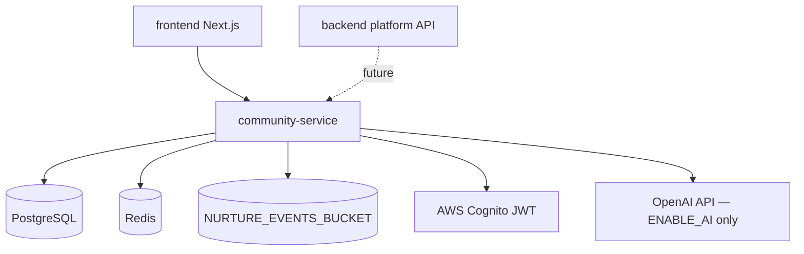
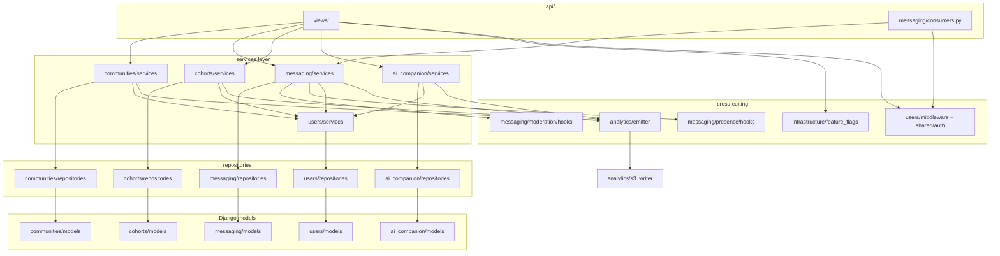

# Community Service — Dependency Map

---

## External dependencies

---

## Python package dependencies

| Package | Purpose | Sprint |
|---------|---------|--------|
| `Django` ≥5.0 | Web framework | 0 |
| `djangorestframework` | REST API | 1 |
| `django-cors-headers` | Frontend CORS | 0 |
| `channels` | WebSocket | 2 |
| `channels-redis` | Channel layer | 2 |
| `daphne` | ASGI server | 2 |
| `psycopg[binary]` | PostgreSQL driver | 1 |
| `redis` | Redis client | 2 |
| `celery` | Async event emission | 4 |
| `boto3` | S3 event writer | 4 |
| `pydantic` | Event schema validation | 4 |
| `python-dotenv` | Env loading | 0 |
| `httpx` | HTTP client (AI provider) | 5 |
| `openai` | LLM provider | 5 |
| `pytest` / `pytest-django` | Tests | 1+ |
| `factory-boy` | Test factories | 1+ |

---

## Internal module dependency graph

---

## Service → service calls (allowed)

| Caller | Callee | Purpose |
|--------|--------|---------|
| `MembershipService` | `CommunityService` | Validate community exists/visible |
| `MembershipService` | `emit_event` | community_joined/left |
| `ChannelService` | `MembershipService` | Verify user in community |
| `MessageService` | `ChannelService` | Validate channel membership |
| `MessageService` | `ModerationHooks` | before_message_send |
| `assign_*_cohort` | `MembershipService` | Auto-join linked community |
| `assign_*_cohort` | `emit_event` | cohort_assigned |
| `QAService` | `AIProvider` | LLM completion |
| `QAService` | `SafetyMiddleware` | Pre/post filters |
| All services | `UserProfileService` | Resolve user from JWT |

**Rule:** No circular imports. Repositories never call services.

---

## Event emission map

| Service action | Event type | S3 domain |
|----------------|------------|-----------|
| `CommunityService.create` | `community_created` | `community/` |
| `MembershipService.join` | `community_joined` | `community/` |
| `MembershipService.leave` | `community_left` | `community/` |
| `MessageService.send` | `message_sent` | `messaging/` |
| `MessageService.mark_read` | `message_read` | `messaging/` |
| `assign_*_cohort` | `cohort_assigned` | `cohorts/` |
| `DiscussionService.create_post` | `post_created` | `messaging/` |
| `DiscussionService.update_post` | `post_updated` | `messaging/` |
| `DiscussionService.delete_post` | `post_deleted` | `messaging/` |
| `DiscussionService.create_comment` | `comment_created` | `messaging/` |
| `DiscussionService.set/remove_post_reaction` | `reaction_added` / `reaction_removed` | `messaging/` |
| `CompanionService.ask/recommend` | `ai_question_asked` | `analytics/` |

---

## Feature flag → module map

| Flag | Blocks |
|------|--------|
| `ENABLE_COMMUNITIES` | `api/views/communities.py`, community services |
| `ENABLE_GROUP_CHAT` | `api/views/messaging.py`, WS consumers, message services |
| `ENABLE_COHORTS` | `api/views/cohorts.py`, assignment services |
| `ENABLE_AI` | `api/views/ai_companion.py`, AI providers |

Decorator: `@require_feature("ENABLE_COMMUNITIES")` on views (implement Sprint 0).

---

## Monorepo shared dependencies (future)

| Shared module | Used by | Status |
|---------------|---------|--------|
| `shared/auth/cognito.py` | users middleware | TODO Sprint 1 |
| `shared/types/events.py` | analytics emitter | TODO Sprint 4 |
| `infrastructure/aws/s3.py` | analytics s3_writer | TODO Sprint 4 |

---

## Deployment dependencies (out of Phase 1)

Not implemented in Phase 1:

- ECS/Fargate task definition
- RDS PostgreSQL provisioning
- ElastiCache Redis
- CI/CD pipeline
- Secrets Manager rotation

Local Docker Compose satisfies Phase 1 dev needs.
