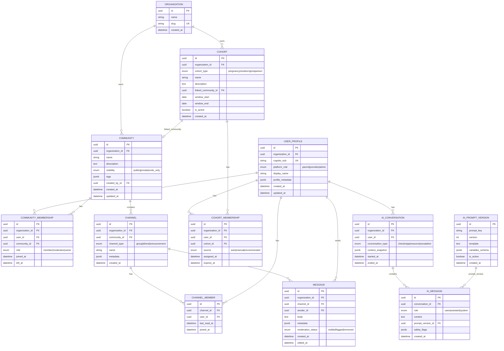
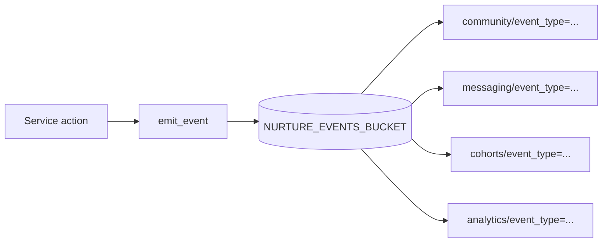

# Community Service — ERD

All operational entities live in **PostgreSQL**. Analytics history in **S3** (not shown as entities).

---

## Full ERD

---

## Relationship notes

| Relationship | Cardinality | Notes |
|--------------|-------------|-------|
| User ↔ Community | M:N | Via `COMMUNITY_MEMBERSHIP`; soft leave via `left_at` |
| User ↔ Cohort | M:N | Multiple cohorts allowed |
| Community ↔ Channel | 1:N | DMs have `community_id = NULL` |
| Channel ↔ Message | 1:N | Paginated by `(channel_id, created_at)` |
| Cohort ↔ Community | N:1 | Optional linked community for auto-join |
| Organization ↔ * | 1:N | Multi-tenant prep on all major tables |

---

## S3 event flow (logical, not relational)

