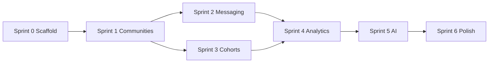

# Community Service — Migration Plan

Aligned with approved build order: **Communities → Messaging → Cohorts → Analytics → AI**

---

## Sprint overview

| Sprint | Focus | Migrations | Endpoints | Tests |
|--------|-------|------------|-----------|-------|
| 0 | Scaffold | — | `/health/` | smoke |
| 1 | Communities | users, communities | community CRUD + join/leave | unit + API |
| 2 | Messaging | messaging | channels, messages, WS | unit + WS integration |
| 3 | Cohorts | cohorts | cohort list, assign, recommend | unit + API |
| 4 | Analytics | — | emit_event wired to all actions | emitter tests |
| 5 | AI layer | ai_companion | AI abstraction endpoints | stub provider tests |
| 6 | Polish | seed data | OpenAPI docs | e2e smoke |

---

## Sprint 0 — Scaffold (no business logic)

**Goal:** Runnable Docker environment, empty Django apps, feature flags.

| Task | Output |
|------|--------|
| 0.1 | `community-service/` folder tree |
| 0.2 | `docker-compose.yml` — Postgres, Redis, app |
| 0.3 | Django project `community_platform` + ASGI |
| 0.4 | Empty apps: users, communities, messaging, cohorts, ai_companion, analytics, api |
| 0.5 | `infrastructure/feature_flags.py` |
| 0.6 | `GET /health/` |
| 0.7 | `.env.example`, `docs/local-dev.md` |
| 0.8 | `shared/auth/` README stub (Cognito reuse TODO) |

**Exit criteria:** `docker compose up` → health 200. No models yet.

---

## Sprint 1 — Communities

**Goal:** Community discovery, join, leave + events.

### Migrations

```
users/migrations/0001_initial.py
  - organizations_organization
  - users_userprofile
  - RunPython: seed default organization

communities/migrations/0001_initial.py
  - communities_community
  - communities_membership
  - indexes + partial unique on active membership
```

### Services (implement)

- `CommunityService.create()`, `.list()`, `.get()`
- `MembershipService.join()`, `.leave()`
- `UserProfileService.get_or_create_from_jwt()` — TODO Cognito integration

### Events

- Wire `community_created`, `community_joined`, `community_left` → `emit_event()` stub

### Tests

- Model constraints (unique active membership)
- Join public / reject private
- Leave soft-deletes membership
- Feature flag `ENABLE_COMMUNITIES=false` → 503

---

## Sprint 2 — Messaging

**Goal:** Group + DM chat, REST history, WebSocket realtime.

### Migrations

```
messaging/migrations/0001_initial.py
  - messaging_channel
  - messaging_channelmember
  - messaging_message
  - indexes on (channel_id, created_at)
```

### Services

- `ChannelService.create_group()`, `.create_direct()`, `.list_for_user()`
- `MessageService.send()`, `.list_history()`, `.mark_read()`
- `ModerationHooks.before_message_send()` — stub ALLOW
- `PresenceHooks` — stub no-op

### Realtime

- Django Channels routing + Redis channel layer
- `MessagingConsumer` delegates to `MessageService`

### Events

- `message_sent`, `message_read`

### Tests

- DM deduplication (same participant pair → one channel)
- WS send/receive round-trip
- Read receipt updates `last_read_at`
- `ENABLE_GROUP_CHAT=false` → 503

---

## Sprint 3 — Cohorts

**Goal:** Hard-coded assignment + recommendations.

### Migrations

```
cohorts/migrations/0001_initial.py
  - cohorts_cohort
  - cohorts_membership
```

### Services

- `assign_pregnancy_cohort(user_id, profile)`
- `assign_postpartum_cohort(user_id, profile)`
- `assign_newborn_cohort(user_id, profile)`
- `assign_all_cohorts()` — re-runnable, idempotent
- `RecommendationService.recommend()` — rule-based scoring
- Auto-join linked community on cohort assign

### Events

- `cohort_assigned`

### Tests

- Multiple cohort memberships
- Re-run assignment adds new matches only
- Profile metadata edge cases (missing due_date)

---

## Sprint 4 — Analytics events

**Goal:** Production-ready `emit_event()` to S3.

### Implementation

- `analytics/events.py` — typed event dataclasses
- `analytics/emitter.py` — `emit_event(event: CommunityEvent)`
- `analytics/s3_writer.py` — partition path builder
- `analytics/tasks.py` — Celery task with retry (3x exponential backoff)
- Reuse `NURTURE_EVENTS_BUCKET` with domain prefixes

### Path builder

```python
def event_s3_key(domain: str, event_type: str, event_id: str, dt: datetime) -> str:
    return (
        f"{domain}/event_type={event_type}/"
        f"year={dt.year}/month={dt.month:02d}/day={dt.day:02d}/hour={dt.hour:02d}/"
        f"{event_id}.json"
    )
```

### Tests

- Path partitioning correctness
- Event schema validation
- Retry on S3 failure (mocked)
- Local: write to `./.data/events/` when `EVENTS_USE_LOCAL=true`

### Backfill

Wire emitter to all Sprint 1–3 service actions if not already done.

---

## Sprint 5 — AI layer

**Goal:** Provider abstraction + four functions + safety middleware.

### Migrations

```
ai_companion/migrations/0001_initial.py
  - ai_companion_promptversion
  - ai_companion_conversation
  - ai_companion_message
  - RunPython: seed prompt v1 templates
```

### Services

- `AIProvider` protocol + `StubProvider` + `OpenAIProvider`
- `SafetyMiddleware.pre()`, `.post()`
- `CheckinService.daily_checkin()`
- `QAService.answer_question()`
- `ResourceService.recommend_resources()`
- `EscalationService.escalate_to_human()` — TODO queue integration

### Events

- `ai_question_asked`

### Tests

- Stub provider full conversation flow
- Safety middleware blocks flagged patterns (stub rules)
- Prompt version selection
- `ENABLE_AI=false` → 503

---

## Sprint 6 — Polish

| Task | Output |
|------|--------|
| 6.1 | `manage.py seed_community_demo` |
| 6.2 | OpenAPI schema (`drf-spectacular` optional) |
| 6.3 | API documentation publish to `docs/api-contracts.md` sync |
| 6.4 | E2E smoke: join community → send message → assign cohort |
| 6.5 | Frontend integration notes for `src/app/(site)/apps/community/` |

---

## Rollback strategy

- Each sprint migration is reversible (`migrate app zero` in dev only)
- Feature flags allow disabling domains without rollback
- S3 events are append-only — no rollback needed

---

## Dependencies between sprints



Messaging depends on communities (channels belong to communities).  
Cohorts depend on communities (linked_community_id, auto-join).  
Analytics depends on all action services existing.  
AI is independent but emitted last.
