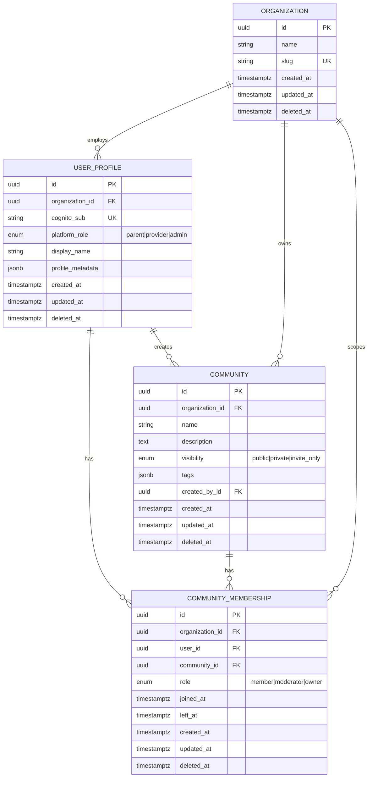
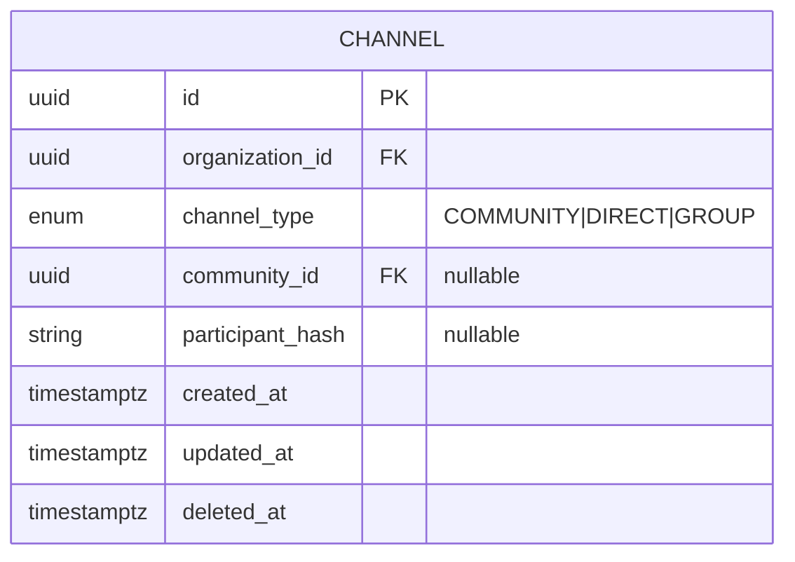

# Sprint 1 — ERD

Sprint 1 implements **organizations**, **user profiles**, **communities**, and **memberships** only.

Channel model is **defined** for Sprint 2 alignment but **not migrated** in Sprint 1.

---

## Sprint 1 entities



---

## Sprint 2 preview (not built in Sprint 1)

Explicit channel types per approved adjustment:



| channel_type | community_id | participant_hash |
|--------------|--------------|------------------|
| `COMMUNITY` | **required** | NULL |
| `DIRECT` | nullable | **required** (sorted UUID pair) |
| `GROUP` | nullable | optional |

---

## Relationship rules

- Every row carries `organization_id` (indexed).
- `COMMUNITY.created_by_id` → `USER_PROFILE` (nullable for seeded communities).
- Active membership: `left_at IS NULL AND deleted_at IS NULL`.
- Soft delete: set `deleted_at`; do not hard-delete memberships in Sprint 1.

---

## Event entities (not relational)

Events emitted to storage backend (Sprint 1 hooks call `emit_event`; full storage Sprint 4):

```
community/event_type=community_created/...
community/event_type=community_joined/...
community/event_type=community_left/...
```

Each event payload includes `organization_id`.
