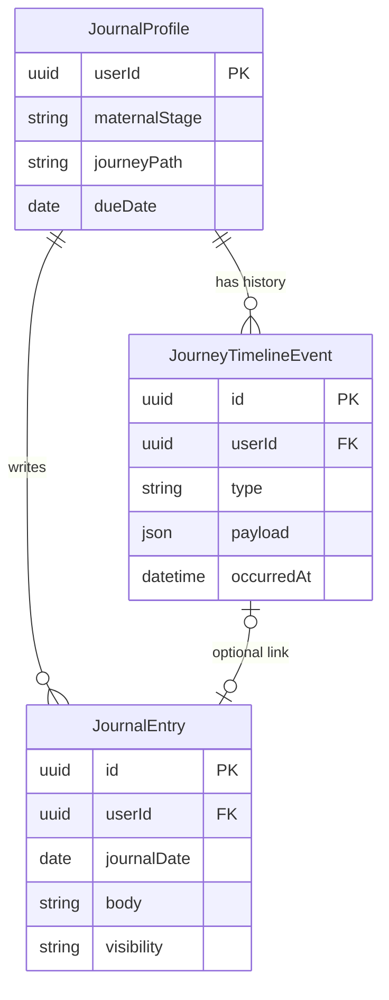
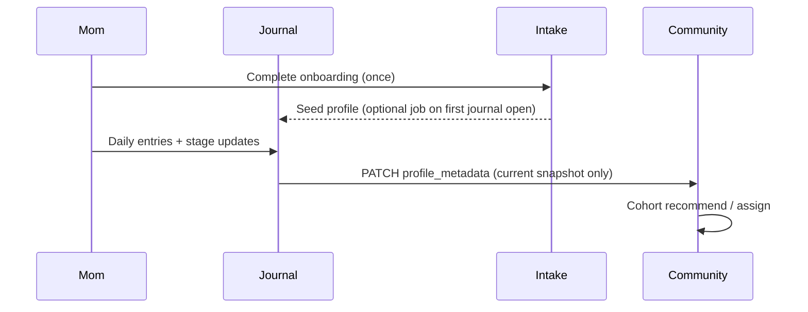

# Wellness Journal — Data Model Sketch

**Status:** J0–J1 implemented (profile, timeline, entries, `/apps/journal`)  
**App:** `/apps/journal` (member-facing, **coming soon** today)  
**Goal:** A **private**, calm, journal-feeling space for moms and future moms — not a social feed.

---

## Product principles

| Principle | Implication |
|-----------|-------------|
| **Private by default** | Only the signed-in member (and later, explicitly shared slices) can read body content. Never mixed into community posts or cohort feeds. |
| **Journal-first UX** | Dated entries, optional prompts, timeline — not forms-first like intake. |
| **Journey-aware** | Stage (TTC, IVF, pregnant, postpartum, etc.) is tracked over **time**, not a single snapshot. |
| **Inclusive paths** | IVF, surrogacy, adoption, loss, and “future mom” states are first-class — due date optional. |
| **Community is a consumer** | Peer groups read **current** journey fields; the journal is the **source of truth** for those fields. |
| **Coordinator access is opt-in** | Care team sees only what the member shares (Phase 2+). |

---

## What exists today (context)

| System | Role |
|--------|------|
| **Intake** (S3/local) | Onboarding snapshot: stage, due date, interests. Not a diary. |
| **Community `profile_metadata`** | Copy of journey fields for **cohort matching** only. |
| **Wellness journal app** | Placeholder (`MemberComingSoonPage`). |

The journal **replaces** duplicating journey edits in Community over time; Community should eventually **subscribe** to journal profile updates.

---

## Recommended storage (MVP → scale)

### MVP: private object store (mirrors intake pattern)

- **Bucket:** same member-data bucket as intake (`INTAKE_S3_BUCKET` / `TASKS_S3_BUCKET`) or dedicated `MEMBER_JOURNAL_S3_BUCKET`.
- **Prefix:** `journal/v1/users/{user_key}/` where `user_key` = Cognito `sub` (never email in paths).
- **Access:** only Next.js API routes with member JWT; **no** admin list routes; **no** community-service read of entry bodies.

**Objects:**

| Object | Purpose |
|--------|---------|
| `profile.json` | Current journey snapshot (see § Profile) |
| `timeline.jsonl` or `timeline/{yyyy-mm}.json` | Append-only journey events (stage changes, EDD updates) |
| `entries/{entry_id}.json` | One journal entry per file (easy delete/export) |
| `index.json` | Lightweight entry index (date, type, title preview hash) for calendar view |

**Why not Postgres first:** fastest path to “private journal” without widening community DB access; matches team’s S3 intake skillset.

### Phase 2 (when needed)

Move **index + timeline** to PostgreSQL (member app DB or `community-service` **`journal_*` tables with strict RLS**) if you need:

- Full-text search across entries
- Coordinator shared views with fine-grained ACL
- Heavy analytics on structured check-ins

Keep **entry body** in S3 or encrypt in DB — bodies can get long.

---

## Core entities

### 1. `JournalProfile` (singleton per member)

Canonical **current** journey state. Updating this triggers optional sync to `community-service` `users.profile_metadata`.

```typescript
interface JournalProfile {
  version: 1;
  userId: string;              // Cognito sub
  createdAt: string;           // ISO
  updatedAt: string;

  // Journey (aligns with intake + community journeyStages)
  maternalStage: MaternalStage | null;
  journeyPath: "ttc" | "ivf" | "other" | null;

  dueDate: string | null;              // ISO date — firm or estimated
  dueDateSource: "confirmed" | "estimated" | "ivf_clinic" | null;

  postpartumWeeks: number | null;      // derived or self-reported
  babyBirthDate: string | null;        // optional anchor for auto weeks

  // Optional context (private)
  pregnancyNotes: string | null;       // short free text, e.g. IVF cycle #
  displayNameInJournal: string | null; // how she wants to address herself in entries

  preferences: {
    dailyReminder: boolean;
    reminderLocalTime: string | null;  // "09:00"
    defaultEntryVisibility: "private";
  };
}
```

**Not stored here:** intake marketing fields (insurance, budget) — stay in intake.

---

### 2. `JourneyTimelineEvent` (history — “how I got here”)

Immutable-ish log of stage and date changes. Powers a vertical timeline in the UI.

```typescript
type JourneyEventType =
  | "stage_changed"
  | "due_date_set"
  | "due_date_updated"
  | "journey_path_set"
  | "baby_born"
  | "ivf_milestone"      // e.g. retrieval, transfer, positive test
  | "custom_milestone";

interface JourneyTimelineEvent {
  id: string;              // uuid
  userId: string;
  occurredAt: string;      // ISO — user can backdate
  type: JourneyEventType;
  payload: {
    fromStage?: MaternalStage;
    toStage?: MaternalStage;
    journeyPath?: "ttc" | "ivf" | "other";
    dueDate?: string;
    label?: string;        // "Embryo transfer", "First beta HCG"
    note?: string;           // optional short private note
  };
  createdAt: string;
}
```

**Examples:**

- `{ type: "stage_changed", toStage: "trying-to-conceive", journeyPath: "ivf" }`
- `{ type: "ivf_milestone", label: "Egg retrieval" }`
- `{ type: "due_date_updated", dueDate: "2026-09-12" }`
- `{ type: "baby_born", payload: { babyBirthDate: "2026-03-01" } }` → auto postpartum stage suggestion

---

### 3. `JournalEntry` (the diary)

The main **journal-feeling** artifact: one moment in time.

```typescript
type JournalEntryType =
  | "freeform"           // open journal
  | "daily_checkin"      // short structured day
  | "prompt"             // responded to a guided prompt
  | "milestone"          // linked to JourneyTimelineEvent
  | "voice_note";        // future: audio URL in S3

type MoodScale = 1 | 2 | 3 | 4 | 5;  // 1 low → 5 great

interface JournalEntry {
  id: string;
  userId: string;
  entryType: JournalEntryType;

  /** Calendar day in member's intent (YYYY-MM-DD) */
  journalDate: string;
  createdAt: string;
  updatedAt: string | null;

  title: string | null;           // optional — “Hard night”, “Transfer day”
  body: string;                   // markdown or plain text

  // Optional structured chips (daily_checkin)
  mood: MoodScale | null;
  sleepQuality: MoodScale | null;
  tags: string[];                 // "feeding", "anxiety", "partner", "ivf"

  /** Always private in MVP */
  visibility: "private";

  /** Links */
  linkedTimelineEventId: string | null;
  promptId: string | null;        // e.g. "gratitude-1"

  attachments: {
    id: string;
    kind: "image";
    s3Key: string;
    caption: string | null;
  }[];
}
```

**UX mapping:**

| Entry type | UI |
|------------|-----|
| `freeform` | Blank page, date header, soft serif textarea |
| `daily_checkin` | Mood icons + one line + optional tags |
| `prompt` | Gentle question at top (“What do you need today?”) |
| `milestone` | Timeline card + optional longer reflection |

---

### 4. `JournalEntryIndexItem` (denormalized for lists)

Stored in `index.json` — no body text (privacy + performance).

```typescript
interface JournalEntryIndexItem {
  id: string;
  journalDate: string;
  entryType: JournalEntryType;
  titlePreview: string | null;   // first 80 chars, stripped
  mood: MoodScale | null;
  updatedAt: string;
}
```

---

## Entity relationship (logical)



---

## API sketch (Next.js BFF)

All routes require Cognito member auth. **No** community-service proxy for entry bodies.

| Method | Path | Action |
|--------|------|--------|
| `GET` | `/api/journal/profile` | Read `JournalProfile` |
| `PATCH` | `/api/journal/profile` | Update profile + append timeline events if stage/dates changed |
| `GET` | `/api/journal/timeline` | List `JourneyTimelineEvent` (paginated) |
| `POST` | `/api/journal/timeline` | Add milestone / stage change |
| `GET` | `/api/journal/entries?from=&to=` | List index for date range |
| `GET` | `/api/journal/entries/{id}` | Full entry |
| `POST` | `/api/journal/entries` | Create entry |
| `PATCH` | `/api/journal/entries/{id}` | Edit own entry |
| `DELETE` | `/api/journal/entries/{id}` | Hard delete (right to erase) |

**Side effect on profile PATCH:**  
`syncJournalProfileToCommunity()` — same mapping as `buildJourneyMetadata()` today — updates `PATCH /api/community/users/me` `profile_metadata` and optional `POST /cohorts/assign`.

---

## Privacy & security

| Rule | Implementation |
|------|----------------|
| Member-only read/write | Verify JWT `sub` on every route; object keys include `sub`. |
| No admin browse | No `/admin/journal/*` in MVP. |
| No community leakage | `JournalEntry.body` never sent to `community-service`. |
| S3 bucket policy | Private; presigned PUT for attachments; SSE-S3 or KMS. |
| Analytics | Emit only aggregates: `journal_entry_created`, `journal_checkin_completed` — **no** body, no mood value in events (or hashed buckets). |
| Export | Phase 2: member-initiated ZIP/JSON export of **their** objects. |
| Care team (later) | `visibility: "care_team"` + separate shared index; coordinator UI reads only shared entries. |

---

## Sync with intake & community



| Direction | Behavior |
|-----------|----------|
| Intake → Journal | On first visit: prefill `JournalProfile` from `IntakeProfile` if journal empty. |
| Journal → Community | On profile save: push `maternal_stage`, `journey_path`, dates, weeks. |
| Community → Journal | **Never** pull posts into journal. |

---

## UI information architecture (journal feeling)

```
/apps/journal
├── Today          — quick check-in + “Continue writing” if draft
├── Calendar       — month grid from entry index
├── Timeline       — journey events (IVF, stage changes)
├── Entries/{id}   — full-page reader/editor (distraction-free)
└── Settings       — reminders, export, “Share with care team” (later)
```

**Tone:** warm neutrals, generous whitespace, date as hero, optional prompts — not dashboard cards.

---

## MVP scope (suggested build order)

| Phase | Deliverable |
|-------|-------------|
| **J0** | `JournalProfile` + timeline events + S3 layout + `/api/journal/profile` |
| **J1** | `JournalEntry` CRUD + calendar list + freeform + daily check-in |
| **J2** | Replace Community “Your journey” with “Manage in Journal” link + sync |
| **J3** | IVF milestone presets, baby birth → postpartum suggestion |
| **J4** | Prompts library, attachments, care-team sharing |

---

## TypeScript package layout (monorepo)

```
src/types/journal.ts              # interfaces above
src/lib/journal/storage.ts        # S3/local read-write (mirror intake)
src/lib/journal/syncCommunity.ts  # profile_metadata push
src/lib/journal/prompts.ts        # static prompt catalog
src/app/api/journal/**            # BFF routes
src/components/Journal/**         # UI
```

---

## Open decisions (for you to confirm later)

1. **Same bucket as intake vs dedicated journal bucket** — dedicated is cleaner for IAM/lifecycle.
2. **Markdown vs plain text** in `body` — plain + limited formatting in MVP.
3. **Whether postpartum weeks auto-compute** from `babyBirthDate` or stay manual.
4. **Loss / rainbow baby** — add `maternalStage` or `journeyPath` values in intake types when implementing.

---

## Related docs

- [communities-implementation-plan.md](../../community-service/docs/communities-implementation-plan.md) — cohorts & community
- [intake-workflow.md](./intake-workflow.md) — onboarding storage
- Member app registry: `src/config/memberApps.ts` (`journal` planned features)
